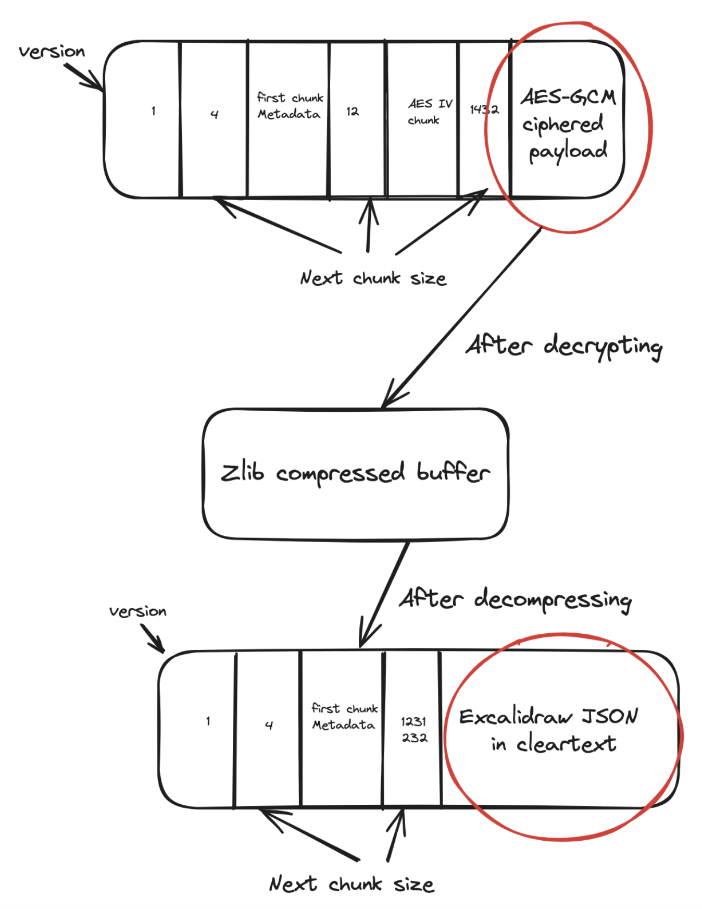

# Excalidraw Decrypt

CLI tool and library that allows fetching Excalidraw diagrams as Plain text, which can be used for storage and combined with other tools to render the diagrams.

# Background
The library relies on the parameters obtained from Excalidraw shareable links, which have the following format

`https://excalidraw.com/#json=documentID,decryptionKey`

# Install

```
# go >= 1.17
# Using `go get` to install binaries is deprecated.
# The version suffix is mandatory.
go install github.com/loveholidays/excalidrawdecrypt@latest

# go < 1.17
go get github.com/loveholidays/excalidrawdecrypt
```

## Homebrew

```
brew install loveholidays/tap/excalidrawdecrypt
```
## Linux
Grab the latest OS/Arch compatible binary from our [Releases](https://github.com/loveholidays/excalidraw-decrypt/releases) page.

# Usage

## CLI

```
excalidraw-decrypt documentID,decryptionKey
```

For example

```
excalidraw-decrypt pJK6JcJMr7LGOuy1NbCKP,YneEARvxllEU6vlDQfz81
```

## As a library

```
decrypter := excalidrawdecrypt.CreateShareableExcalidrawDecrypter()
decrypt, err := decrypter.Decrypt("pJK6JcJMr7LGOuy1NbCKP,YneEARvxllEU6vlDQfz81A")
```

# Decryption process
Using a public Excalidraw API to download the ciphered diagram:

https://json.excalidraw.com/api/v2/documentID

The downloaded diagram is decrypted using the decryptionKey from the shareable link.

The diagram in this shareable link paints the picture of the steps required to get the Excalidraw file in plaintext:
https://excalidraw.com/#json=pJK6JcJMr7LGOuy1NbCKP,YneEARvxllEU6vlDQfz81A


