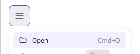

# Excalidraw Decrypt

CLI tool and library that allows fetching Excalidraw diagrams as Plain text from the Excalidraw public API, which can be used for storage and combined with other tools to render the diagrams.

# Background
The library relies on the parameters obtained from Excalidraw shareable links, which have the following format

`https://excalidraw.com/#json=documentID,decryptionKey`

# Install

## Install using go toolchain

```
go install github.com/loveholidays/excalidrawdecrypt@latest
```

## Install using homebrew

```
brew install loveholidays/tap/excalidrawdecrypt
```
## Install by downloading the binary from Github releases
Grab the latest OS/Arch compatible binary from our [Releases](https://github.com/loveholidays/excalidraw-decrypt/releases) page.

# Usage

## Use as a CLI tool

Given an Excalidraw shareable link, for example `https://excalidraw.com/#json=pJK6JcJMr7LGOuy1NbCKP,YneEARvxllEU6vlDQfz81A` just need to run the tool in the command line, passing as an argument what's in the URL after `#json=`.

```
excalidraw-decrypt pJK6JcJMr7LGOuy1NbCKP,YneEARvxllEU6vlDQfz81A > my_diagram.excalidraw
```

## Use as a library

Simply create a decrypter client and pass the same argument as a single string. Find an [example on this codebase](https://github.com/loveholidays/excalidraw-decrypt/blob/main/pkg/excalidrawdecrypt/excalidraw-decrypt/excalidrawdecrypt.go#L35-L38).

```
decrypter := excalidrawdecrypt.CreateShareableExcalidrawDecrypter()
plaintext, err := decrypter.Decrypt("pJK6JcJMr7LGOuy1NbCKP,YneEARvxllEU6vlDQfz81A")
```

# Integration with Excalidraw

## What if I want to import the plaintext in a new Excalidraw canvas?

You can import back the fetched plaintext diagram to excalidraw to continue editing, opening the file in Excalidraw  

## What if I want to continue editing the original document?

To continue editing the original document, simply visit the Excalidraw shareable link on a browser

# Decryption process
Using a public Excalidraw API to download the ciphered diagram:

https://json.excalidraw.com/api/v2/documentID

The downloaded diagram is decrypted using the decryptionKey from the shareable link.

The diagram in this shareable link paints the picture of the steps required to get the Excalidraw file in plaintext:
https://excalidraw.com/#json=pJK6JcJMr7LGOuy1NbCKP,YneEARvxllEU6vlDQfz81A


